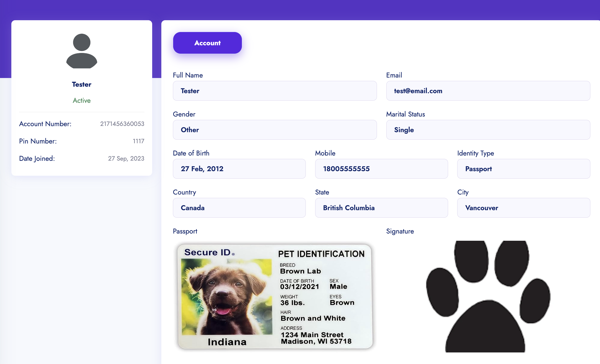
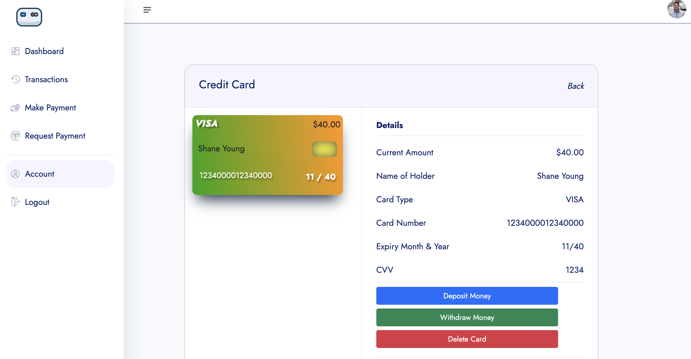
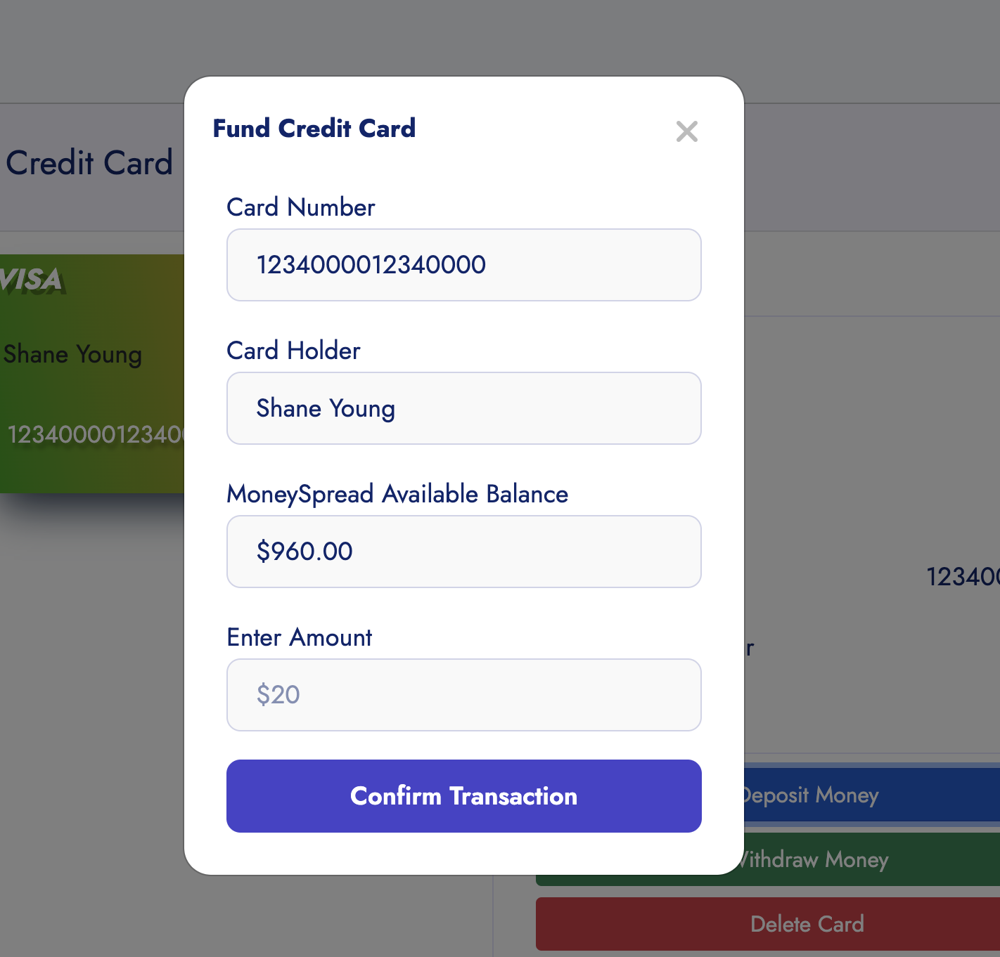
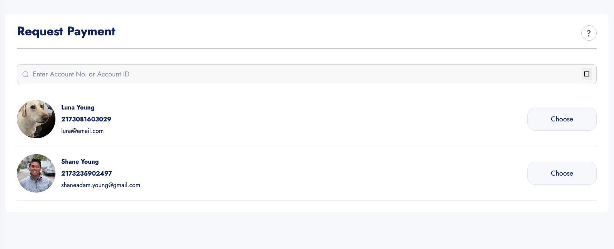
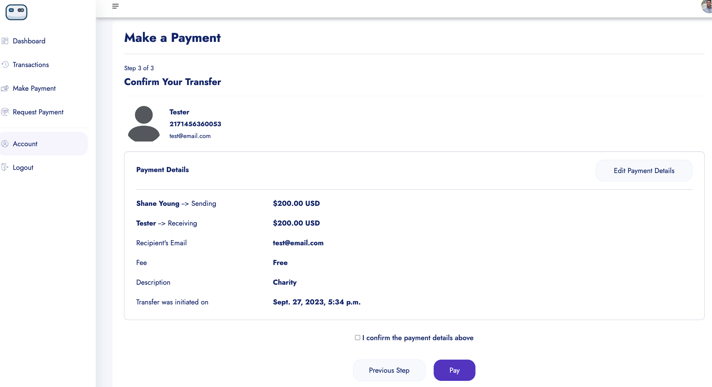
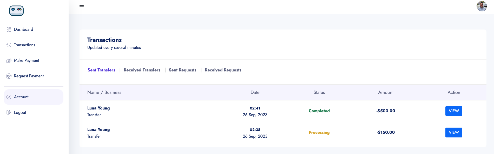
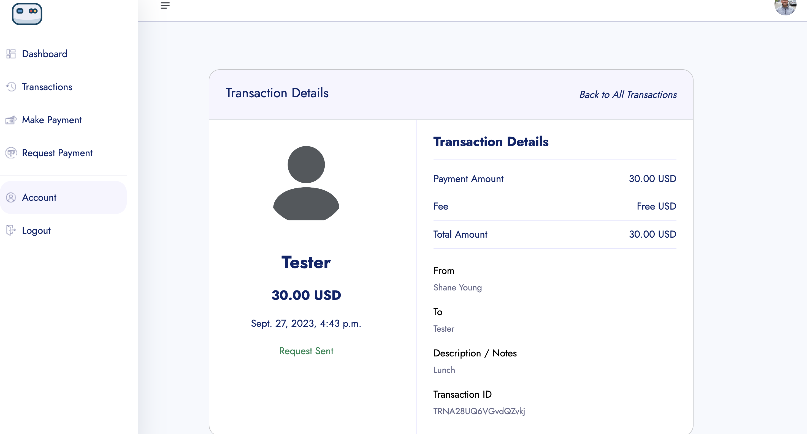

# MoneySpread - A Digital Payment Application

- Leveraged Python, Django, and PostgreSQL to build a feature-rich digital payments application, similar to Venmo, CashApp, and Zelle.

- Demonstrated knowledge of Django by creating dynamic views and managing complex data models for seamless application functionality.

- Ensured a seamless user experience by integrating essential banking features, such as account management, fund transfers, and transaction history.

## Link to App :link:
[MoneySpread](https://moneyspread-259abb181ed5.herokuapp.com/)

---

## User Dashboard 


---

## Account Detail 


---

## Credit Card Details 


---

## Deposits Funds to Card


---

## Withdraw Funds from Card


---

## Request Payment from Users


---

## Confirm Payment


---

## Transactions


---

## Transaction Detail


---

## Code Preview
```python
class CreditCard(models.Model):
    user = models.ForeignKey(User, on_delete=models.CASCADE)
    card_id = ShortUUIDField(unique=True, length=5, max_length=20, prefix="CARD", alphabet="1234567890")
    
    name = models.CharField(max_length=100)
    card_number = models.PositiveBigIntegerField()
    month = models.IntegerField()
    year = models.IntegerField()
    cvv = models.IntegerField()
    
    amount = models.DecimalField(max_digits=12, decimal_places=2, default=0.00)
    
    card_type = models.CharField(choices=CARD_TYPE, max_length=50, default="Mastercard")
    card_status = models.BooleanField(default=True)
    
    date = models.DateTimeField(auto_now_add=True)
    
    def __str__(self):
        return f"{self.user}"
```
---
## Technologies Used
 
 
 
 <br>
 
 
 
 <br>
 

---
## Future Enhancements
   - [ ] Search bar feature on dashboard to find user accounts
   - [ ] Notification system when requests/transfers are made and their status updates
   - [ ] Exchange rate feature for other currencies
   - [ ] Updated dashboard featuring recent transactions
---
